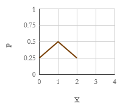

# Случайные величины

1. Виды СВ. Задание ДСВ
2. МО ДСВ
3. Дисперсия ДСВ
4. Подготовка к КР
5. Функция распределения вероятностей СВ
6. Плотность распределения вероятностей НСВ 
7. Нормальное распределение

## Виды случайных величин. Задание дискретной случайной величины

### Случайные величины. Дискретные и непрерывные случайные величины

Мы рассмотрим событие, состоящее в появлении какого-либо числа.

Например, появление числа при бросании кости (нельзя наперёд определить число выпавших очков, так как это случайная величина).

Возможные значения случайной величины.

**Случайная величина** (СВ) — величина, которая в результате испытания примет единственное $∃!$ значение, зависящее от случайных причин, которые не могут быть учтены заранее.

Обозначаются прописными буквами $X, Y, Z$, а их возможные значения с соответствующими строчными буквами: $x, y, z$.

$⊗$ СВ $X$ имеет три возможных значения $\{x_1, x_2, x_3\}$

**Дискретная случайная величина** (ДСВ) — величина, принимающая отдельные возможные значения с определенными вероятностями.

$⊗$ Число родившихся мальчиков из 100 новорождённых — ДСВ с возможными значениями от 0 до 100.

Эти возможные значения отделены друг от друга промежутками, в которых возможных значений нет. Число возможных значений ДСВ может быть конечным или бесконечным.

**Непрерывная случайная величина** (НСВ) — величина, принимающая все значения из некоторого конечного или бесконечного промежутка.

$⊗$ Расстояние, которое пролетит снаряд при выстреле — НСВ с возможными значениями, принадлежими некоторыми промежутку $[a;b]$. Здесь нет интервалов между возможными значениями случайной величины. Число возможных значений НСВ бесконечно.

### Закон распределения вероятностей ДСВ

На первый взгляд, для задания ДСВ достаточно перечислить все возможные значения. Но СВ могут принимать одинаковые возможные значения, то есть различные вероятности.

**Закон распределения** ДСВ — соответствие между возможными значениями СВ и их вероятностями.

Его можно задать 

- аналитически (формулой), 
- графически (многоугольник распределения), 
- таблично.

| $X$ | $x_1$ | $x_2$ | … | $x_n$ |
| --- | ----- | ----- | - | ----- |
| $P$ | $p_1$ | $p_2$ | … | $p_n$ |

В одном испытании ДСВ принимает единственное возможное значение, следовательно события вида $A_i = \{X = x_i\}$ образуют полную группу. То есть

$$\sum p_i = 1$$

***

$⊗$ В денежной лотерее 100 билетов. Разыгрывается один приз по 500₽ и 10 призов по 100₽. Найти закон распределения стоимости возможных выигрышей для лотерейного билета.

| $X$ | 0                    | 100                | 500                 |
| --- | -------------------- | ------------------ | ------------------- |
| $P$ | $\frac {89} {100}$ | $\frac {1} {10}$ | $\frac {1} {100}$ |

### Биномиальное распределение

Пусть произведено $n$ независимых испытаний, в каждом из которых событие $A$ может появиться или не появиться. Рассмотрим в качестве ДСВ число появлений события в этих испытаниях.

Найдём закон распределения ДСВ. Для этого нужно найти возможные значения ДСВ и их вероятности. В $n$ испытаниях событие может появиться от 1 до $n$ раз. Вероятности рассчитываются по формуле Бернулли.

$$P_n(k) = C_n^k p^kq^{n-k}$$

**Биномиальное распределение** — распределение, рассчитывающееся по формуле Бернулли. 

$⊗$ Монета брошена два раза. Написать в виде таблицы закон распределения ДСВ — числа выпавших гербов.

> $p_0=P_2(0)=\frac 1 4$,
> $p_1=P_2(1)=\frac 1 2$,
> $p_2=P_2(2)=\frac 1 4$.
>
> | $X$ | 0    | 1   | 2    |
> | ----- | ---- | --- | ---- |
> | $P$ | 0.25 | 0.5 | 0.25 |

**Многоугольник распределения** — графическое представление биномиального закона.

***

$⊗$ В партии $p=\frac 1 {10}$ нестандартных деталей. Наудачу отобраны 4 детали. Найти биномиальный закон распределения ДСВ числа нестандартных деталей среди 4 отобранных и построить многоугольник этого распределения.

> $P_4(k) = C_4^k \frac {9^{4-k}} {10^4}$
> 
> $P_4(0) = 1 ⋅ \frac {9^4} {10^4}$
> 
> $P_4(1) = 1 ⋅ \frac {9^3} {10^4}$
> 
> $P_4(2) = 1 ⋅ \frac {9^2} {10^4}$
> 
> $P_4(3) = 1 ⋅ \frac {9^1} {10^4}$
> 
> $P_4(4) = 1 ⋅ \frac {9^0} {10^4}$
> 
> | $X$ | 0      | 1      | 2      | 3      | 4      |
> | ----- | ------ | ------ | ------ | ------ | ------ |
> | $P$ | 0.6561 | 0.2916 | 0.0486 | 0.0036 | 0.0001 |

### Распределение Пуассона

Если число испытаний велико, то пользоваться формула Лапласа, можно, однако, она становится непригодной, если вероятность события мала $p ⩽ 0,1$.

Пусть $λ = np=\text{const}$. Следовательно среднее число появления события в различных сериях испытаний остается неизменным.

$P_n(k) = \frac {λ^ke^{-λ}}{k!}$ (по формуле Бернулли)

$⊗$ Отправлено $n=5000$ деталей. Вероятность повреждения деталей в пути $p=2⋅10^{-4}$. Найти вероятность того, что на базу прибудут три нестандартные детали.

> $λ = 1 ⇒ P_5000(3) = \frac {e^{-1}}{3!} = 0,06$

#### График распределения Пуассона

***

$⊗$ Руководство объемом 1000 страниц содержит 1000 опечаток. Найти вероятность того, что наудачу взятое страница содержит ровно две опечатки.

> $k=2; λ=1 ⇒ P_n(k)=\frac {e^{-λ}}{k!}=0,184$

## Математическое ожидание дискретной случайной величины

### Числовые характеристики ДСВ

Закон распределения полностью характеризует СВ, но иногда выгоднее пользоваться числами, описывающими СВ суммарно. Такие числа называются **числовыми характеристиками** ДСВ.

### Математическое ожидание ДСВ

**Математическое ожидание** — сумма произведений возможных значений СВ на их вероятности.

Если случайная величина задана законом распределения

| $X$ | $x_1$ | $x_2$ | … | $x_n$ |
| --- | ----- | ----- | - | ----- |
| $P$ | $p_1$ | $p_2$ | … | $p_n$ |

то

$$M(X) = \sum x_ip_i$$

$⊗$ Найти $M(X)$, зная ее закон распределения.

| $X$ | 2   | 3   | 5   |
| --- | --- | --- | --- |
| $P$ | 0,3 | 0,1 | 0,6 |

> $$M(X)= 2 ⋅ 0,3 + 3 ⋅ 0,1 + 5 ⋅ 0,6 = 3,9$$

### Вероятностный смысл МО

Пусть произведено $k$ испытаний, в которых ДСВ приняла $m_i$ раз значение $x_i$, $i\in\overline{1,n}$. При этом $\sum m_i = n$.
Тогда сумма всех значений, принятых $X$, будет равна

$$\sum {x_im_i}$$

Найдем среднее арифметическое всех значений принимаемых СВ:

$$\overline X = \frac {\sum {x_im_i}} k$$

**Относительная частота** события — отношение числа испытаний, в которых событие появилось, к общему числу произведенных испытаний.
Где число появление события, общее число испытаний.

$$W(A) = \frac m n,$$

где $m$ — число появлений события,

а $n$ — общее число испытаний.

Понятие схоже с вероятностью, но отличается в том, что определение вероятности не требует, чтобы испытание производились в действительности.

Определение относительной частоты предполагает проведение испытаний.

Вернемся к $\overline X$.

Пусть $W_i = \frac {m_i}{k}$ — относительная частота появления $x_i$. Тогда:

$$\overline X = \sum {x_iW_i}$$

Пусть число испытаний $k$ велико, а значит $W_i ≈ p_i$:

$$\overline X ≈ \sum {x_ip_i}$$

$$\overline X ≈ M(X)$$

Математическое ожидание примерно равно среднему арифметическому наблюдаемых значений СВ.

### Свойства МО

#### 1. МО постоянной

$$M(\text{const})=\text{const}$$

#### 2. Постоянный множитель можно вынести за знак МО

$$M(cX)=cM(X)$$

#### 3. МО произведения СВ

**Замечание 1**. Две СВ называют **независимыми**, если закон распределения одной из них не зависит от того, какие возможные значения приняла другая величинаж; иначе они **зависимы**.

**Замечание 2**. **Произведение** независимых СВ $XY$ — СВ, возможные значения которой равны произведению всех возможных значений $X$ на каждое возможное значение $Y$. Вероятности этих возможных значений равны произведению вероятностей сомножителей.

**Замечание 3.** **Сумма** независимых СВ $X+Y$ — СВ, возможные значения которой равны суммам всех возможных значений со всеми возможными значениями. Вероятности этих возможных значений равны произведениям вероятностей слогаемых.

$$M(XY) = M(X)M(Y)$$

**Доказательство**. Пусть $X$ и $Y$ Заданы законами распределения.

| $X$ | $x_1$ | $x_2$ | $Y$ | $y_1$ | $y_2$ |
| ----- | ------- | ------- | ----- | ------- | ------- |
| $P$ | $p_1$ | $p_2$ | $G$ | $g_1$ | $g_2$ |

Составим все возможные значения которые может принимать $XY$, умножив все значения $X$ на каждое значение $Y$. Учитывая замечание 2, получаем:

| $XY$ | $x_1y_1$ | $x_1y_2$ | $x_2y_1$ | $x_2y_2$ |
| ------ | ---------- | ---------- | ---------- | ---------- |
| $PG$ | $p_1g_1$ | $p_1g_2$ | $p_2g_1$ | $p_2g_2$ |

  
Математическое ожидание равно сумме произведений всех возможных значений на их вероятности:

$$M(XY) = \sum_{i=1}^n \sum_{j=1}^m {x_iy_jp_ig_j} = \sum_{i=1}^n {x_ip_i} ⋅ \sum_{j=1}^m {y_jg_j} = M(X)M(Y)$$

$⊗$ Независимые случайные величины $X$ и $Y$ заданы следующими законами распределения.
Найти $M(XY)$ двумя способами: по свойству 3 и составив общий закон распределения.

| $X$ | 2   | 4   | 5   | $Y$ | 7   | 9   |
| --- | --- | --- | --- | --- | --- | --- |
| $P$ | 0,3 | 0,1 | 0,6 | $G$ | 0,8 | 0,2 |

> $M(X) = 4,4$, $M(Y) = 7,4$. $M(XY) = 32,56$.
> 
> | $XY$ | $2⋅7$ | $4⋅7$ | $5⋅7$ | $2⋅9$ | $4⋅9$ | $5⋅9$ |
> | ---- | ----- | ---- | ------| ----- | ----- | ----- |
> | $pg$ | 0.06  | 0.02 | 0.12  | 0.24  | 0.08  | 0.48  |
> 
> $M(XY) = 32,56$

#### 4. МО суммы СВ

$$M(X+Y) = M(X)+M(Y)$$

**Доказательство.** Аналогично.

$⊗$ Найти математическое ожидание числа очков, которые могут выпасть при бросании двух кубиков.

> | $X$ | 1   | 2   | 3   | 4   | 5   | 6   |
> | --- | --- | --- | --- | --- | --- | --- |
> | $p$ | 1/6 | 1/6 | 1/6 | 1/6 | 1/6 | 1/6 |
>
> $M(X+X) = 2 M(X) = 7$

### МО биномиального распределения

**Теорема**. Математическое ожидание числа появлений события $A$ в $n$ независимых испытаниях равна произведению числа испытаний на вероятность появления события в каждом испытании.

$$M(X) = np$$

$⊗$ Вероятность попадания в цель $p=0,6$. Найти математическое ожидание общего числа попаданий, если будет произведено 10 выстрелов.

> $$M(X)=np=6$$

## Дисперсия дискретной случайной величины

### Отклонение случайной величины от ее МО

Введём понятие отклонение значения от ее математического ожидания.

**Отклонение** СВ — разность между случайной величиной и ее математическим ожиданием. 

$$X - M(X)$$

На практике часто приходится оценивать рассеяния возможных значений случайной величины вокруг ее среднего значения. Например, артиллерия оценивают кучность снарядов вокруг поражаемые цели. 

На первый взгляд кажется, что для оценки рассеяния нужно найти все возможные значения отклонений СВ, а потом их среднее значение. Но может получиться так, что среднее значение $M(X-M(X))$ окажется равным нулю.

Поэтому пришли к решению заменить возможные отклонения их квадратами. Дисперсия характеризует степень рассеяния возможных значений оси от своего среднего значения.

**Дисперсия** СВ — математическое ожидание квадратов отклонений от их среднего значения.

$$D(X) = M\left( (X-M(X))^2 \right)$$

Расчетная формула для дисперсии

$$D(X) = M(X^2) - M(X)^2$$

$⊗$ Найти дисперсию по закону распределения.

| $X$ | 2   | 3   | 5   |
| --- | --- | --- | --- |
| $p$ | 0,1 | 0,6 | 0,3 |

> $$M(X) = 3,5$$
> 
> $$M(X^2)=13,3$$
> 
> $$D(X)=13,3-12,25 = 1,05$$

### Дисперсия биномиального распределения

**Теорема**. Дисперсия числа появлений события $A$ в $n$ независимых испытаниях равна произведению числа испытаний на вероятности появления и не появления события в одном испытании.

$$D(X)=npq$$

$⊗$ Произведено 10 независимых испытаний, в каждом из которых $p=0,6$. Найти дисперсию числа появлений события в этих испытаниях.

> $$D(X) = npq = 2,4$$

$⊗$ СВ $X$ может принимать два значения $x_2>x_1$. $M(X)=2,7$, $D(X)=0,21$. Найти ее значения. ($p_1=0,3; p_2=0,7$)

> $0,3x_1+0,7x_2 = 2,7$
> 
> $0,3x_1^2+0,7x_2^2-2,7^2=0,21$
> 
> $x_{1_1}=2; x_{2_1}=3$
> 
> $x_{1_2}=3,4; x_{2_2}=2,4$

## Функция распределения вероятностей случайной величины

### Интегральная функция распределения 

ДСВ может быть задана перечнем всех и возможных значений и их вероятности, но такой способ не применим для НСВ.

Пусть $X$ своими возможными значениями сплошь заполняют интервал $[a;b]$, тогда перечень значений составить невозможно. Поэтому для описания такой СВ введем интегральную функцию распределения.

**Функция распределения** — функция $F(x)$, определяющая для всех $x\in X$ вероятность того, что $X$ примет значение меньше $x$.

$$F(x) = P(X<x)$$

Геометрически это равенство можно истолковать так: $F(x)$ есть вероятность того, что случайная величина примет значение, которое изображается на числовой оси точкой, лежащей левее точки $x$.

### Свойства

**Свойство 1**. Значение функции распределения принадлежат отрезку $[0;1]$. 

Свойство вытекает из определения функции распределения как вероятности

**Свойство 2**. $F(x)$ — неубывающая функция, то есть $F(x_2) ⩾ F(x_1)$, если $x_2 > x_1$.

**Доказательство**. Пусть $x_2 > x_1$. Событие, заключающееся в том, что СВ примет значение меньше $x_2$, можно разделить на два несовместных события по теореме о сложении вероятностей.

$$P(X<x_2) = P(X<x_1) + P(x_1 ⩽ X < x_2)$$

Отсюда 

$$P(x_1 ⩽ X<x_2) = F(x_2) - F(x_1).$$

Так как любая вероятность есть число неотрицательное, то 

$F(x_2) - F(x_1) ⩾ 0$, или $F(x_2) ⩾ F(x_1)$ (*)

**Следствие 1**. Вероятность того, что $X$ примет значение, заключенное в интервале $(a, b)$, равна приращению функции распределения на этом интервале: 

$$P(a<X<b) = F(b) - F(a)$$

Это следствие вытекает из формулы (*), если положить $x_2=b$ и $x_1 = a$. 
 
$⊗$ Случайная величина задана функцией распределения. Найти вероятность того, что в результате испытания случайная величина примет значение в интервале $(0;2)$.

$$F(x) = \begin{cases}0, & x⩽ -1 \\ \frac x 4+\frac 1 4, & -1 < x ⩽ 3 \\ 1, & x > 3 \end{cases}$$

> $$P(0 < x < 2) = F(2) - F(0) = 0,5$$

**Следствие 2**. Вероятность того, что $X$ примет ровно одно определённое значение, равна нулю.
$P(X = x_0) = 0$

**Доказательство**.

$$P(x < X < x + Δ x) = F(x + Δ x) - F(x).$$ 

Так как $X$ — НСВ, то функция $F(x)$ непрерывна. В силу непрерывности $F (x)$ 

$$\lim_{Δ x → 0} {F(x + Δ x) - F(x)} = 0$$

Cледовательно, $P(X = x_0) = 0$. Используя это положение, легко убедиться в справедливости равенств

$$P(a < X < b) = P(a ⩽ X < b) = P(a < X ⩽ b) = P(a ⩽ X ⩽ b)$$

Таким образом, бессмысленно говорить о том, что НСВ примет одно определенное значение, но имеет смысл рассматривать попадание её в интервал, пусть и сколь угодно малый.

**Свойство 3**. Если возможно значение случайной величины лежат в интервале $[a;b]$, то

$F(x) = 0$ при $x ⩽ a$,

$F(x) = 1$ при $x ⩾ b$.

### График ИФР

1. График расположен в полосе, ограниченной прямыми $y = 0$ и $y=1$.
2. При возрастающем $x$ на интервале $(a,b)$ график функции идет вверх.
3. При $x⩽ a$ ординаты графика равны нулю; при $x ⩾ b$ ординаты графика равны единице.

ДСВ также можно представить ИФР. При этом график будет иметь ступенчатый вид.

$⊗$ ДСВ $X$ задана таблицей распределения. Найти функцию распределения и вычертить ее график. 

| $X$ | 1   | 4   | 8   |
| ----- | --- | --- | --- |
| $p$ | 0,3 | 0,1 | 0,6 |

> $$F(x) = \begin{cases}0, & x < 1 \\ 0,3, & 1 ⩽ x < 4 \\ 0,4, & 4 ⩽ x < 8 \\ 1, & x ⩾ 8 \end{cases}$$

> 

$⊗$ ДСВ $X$ задана таблицей распределения. Найти функцию распределения и вычертить ее график.

| $X$ | 3   | 4   | 7   | 10  |
| ----- | --- | --- | --- | --- |
| $p$ | 0,2 | 0,1 | 0,4 | 0,3 |

> $$F(x) = \begin{cases} 0, & x < 3 \\  0,2, & 3 ⩽ x < 4 \\ 0,3, & 4 ⩽ x < 7 \\  0,7, & 7 ⩽ x < 10 \\  1, & x ⩾ 10 \end{cases}$$

$⊗$ НСВ $X$ задана ИФР. Найти вероятность того, что в результате 4 испытаний $X$ примет значение в интервале $(0,25;0,75)$ ровно три раза.

$$F(x) = \begin{cases} 0, & x < 0 \\  x^2, & 0 ⩽ x < 1 \\   1, & x ⩾ 10 \end{cases}$$

> $p=F(0,75)-F(0,25)=0,5$
> 
> $P(A) = C_4^3p^3q = 0,25$

## Подготовка к контрольной работе

- Формула полной вероятности
- Формула Бернулли
- Интегральная теорема лапласа
- МО и дисперсия.

### Задачи

$⊗$ Имеется 5 черных и 3 белых шара. Случайным образом вынимают 2 шара. Найти вероятность то
го, что среди них был хотя бы один белый шар.

> $$P(A) = 1- \frac {C_5^2C_3^0}{C_2^8}=0,64$$

$⊗$ вероятность попадания в цель при стрельбе из каждого из трех орудий $p=0,7$. Найти вероятность хотя бы одного попадания при одном залпе из каждого орудия.

> $$P(A) = 1 - q^3 = 0,973$$

$⊗$ в группе 22 мальчика и восемь девочек. Для девочки вероятность сдать экзамен $P_{B_1}(A)=0,85$. Для мальчика вероятность сдать экзамен $P_{B_2}(A)=0,8$. Найти вероятность того, что один случайно взятый(-ая) студент(-ка) сдаст экзамен.

> $$P(A)=P(B_1)P_{B_1}(A)+P(B_2)P_{B_2}(A) = 0,813$$

$⊗$ В цеху 8 станков. У каждого станка вероятность того, что он работает 0,8. Найти вероятность того, что сейчас включено 

1. шесть станков, 
2. от 4 до 6 станков включительно.

> $$P(A) = C_8^2p^6q^2=0,293$$
>
> $$P(B) = C_8^2p^6q^2+C_8^3p^5q^3+C_8^4p^4q^4=0,486$$

$⊗$ В каждом из 500 независимых испытаний события происходят $p=0,4$. Найти вероятность того, что событие происходит 

1. 220 раз, 
2. от 180 до 240 раз.

> $$P_{500}(220) = \frac {\varphi(1,826)}{\sqrt{npq}}=0,0069$$
>
> $$P_{500}(180;240) = \Phi(-1,826)-\Phi(3,652)=0,96593$$

$⊗$ Найти математическое ожидание и дисперсию, зная закон распределения.

| $X$ | 1    | 2   | 4   | 10  | 20   |
| ----- | ---- | --- | --- | --- | ---- |
| $p$ | 0,05 | 0,3 | 0,1 | 0,2 | 0,35 |

> $M(X) = 10,05$
>
> $D(X) = 61,8475$

$⊗$ Дано распределение $X$. Найти недостающие части, зная, что $M(X)=5$.

| $X$ | 8       | 3       |
| ----- | ------- | ------- |
| $p$ | $p_1$ | $p_2$ |

> $$8p_1+3p_2 = 5$$
>
> $$p_1+p_2=1$$
>
> $$p_1 = 0,4; p_2 = 0,6$$

## Плотность распределения вероятностей непрерывной случайной величины

### Дифференциальная функция распределения вероятностей НСВ

Способ задания на с помощью интегральной функцией не единственный. Ее можно также задать с помощью дифференциальной функцией распределения вероятностей.

**Дифференциальная функция** $f(x)$ или **плотность вероятностей** — первая производная от интегральной функции распределения.

$$f(x) = F'(x)$$

Зная плотность распределения, можно вычислить вероятность того, что она примет значение, принадлежащее заданному интервалу.

**Теорема**. Вероятность того, что НСВ примет значение, принадлежащее интервалу, равно определенному интегралу плотности распределения.

$$P(a < X ⩽ b) = \int_a^b {f(x)dx}$$

**Доказательство**. Из свойств интегральной функции

$$P(a < X ⩽ b) = F(b) - F(a)$$

А с другой стороны по формуле Ньютона-Лейбница. 

$$F(b) - F(a) = \int_a^b {F'(x)dx} = \int_a^b {f(x)dx}$$

Геометрически полученный результат можно истолковать так: вероятность того, что НСВ примет значение, принадлежащее интервалу $(a,b)$, равна площади криволинейной трапеции, ограниченной осью $Ox$, кривой распределения $f(x)$ и прямыми $x=a$ и $x=b$. 

В общем виде, имея плотность распределения $f(x)$, можно найти функцию распределения $F(x)$ по формуле

$$F(x) = \int_{-\infty}^x {f(x)dx}$$

$⊗$ Найти функцию распределения по данной плотности распределения

$$f(x) = \begin{cases} 0, & x⩽ a \\ \frac 1 {b-a}, & a < x⩽ b \\ 0, & x ⩾ b \end{cases}$$

> $$F(x) =\begin{cases}  \int_{-\infty}^x{0dx}, & x⩽ a \\  \int_{-\infty}^a{0dx} + \int_a^x {\frac 1 {b-a}dx}, & a < x⩽ b \\ \int_{-\infty}^a{0dx} + \int_a^b {\frac 1 {b-a}dx} + \int_b^x {0dx}, & x ⩾ b \end{cases} = \begin{cases}  0, & x⩽ a \\  \frac {x-a}{b-a}, & a < x⩽ b \\ 1, & x ⩾ b \end{cases}$$
> 
> 

### Свойства дифференциальной функции распределения

#### Плотность распределения — неотрицательная функция

$$f(x) ⩾ 0$$

**Доказательство**. Функция распределения — неубывающая функция, следовательно, ее производная $F'(x) =f(x)$ — функция неотрицательная.

Геометрически это свойство означает, что точки, принадлежащие графику плотности распределения, расположены либо над осью $Ox$, либо на этой оси. 

#### Несобственный интеграл от плотности распределения в пределах от −∞ до +∞ равен единице

$$\int_{-\infty}^{+\infty}{f(x)dx} = 1$$

**Доказательство**. Несобственный интеграл $\int_{-\infty}^{+\infty}{f(x)dx}$ выражает вероятность события, состоящего в том, что случайная величина примет значение, принадлежащее интервалу $(-\infty;+\infty)$. Очевидно, такое событие достоверно, следовательно, вероятность его равна единице.

Геометрически это означает, что вся площадь криволинейной трапеции, ограниченной осью $Ox$ и кривой распределения, равна единице. 

***

$⊗$ НСВ задана дифференциальной функцией $f(x) = \frac 2 3 \sin {3x}$ при $0 < x < \frac π 3$. Вне этого интервала функция равна нулю. Найти вероятность того, что случайная величина примет значение из интервала $(\frac π 6;\frac π 4)$.

> $$P(\frac π 6<x<\frac π 4) = \int_{π/6}^{π/4} {\frac 2 3 \sin {3x}} = \frac {\sqrt 2} 9$$

$⊗$ НСВ задана дифференциальной функцией. Найти функцию распределения.

$$f(x) = \begin{cases} 0, & x⩽ 0 \\ \cos x, & 0 < x⩽ \frac π 2 \\ 0, & x > \frac π 2  \end{cases}$$

> $$F(x) = \begin{cases} \int_{-\infty}^x{0dx}, & x⩽ 0 \\  \int_{-\infty}^0{0dx} + \int_0^x {\cos xdx}, & 0 < x⩽ \frac π 2 \\  \int_{-\infty}^0{0dx} + \int_0^{\frac π 2} {\cos xdx} + \int_{\frac π 2}^x{0dx}, & x > \frac π 2  \end{cases}=\begin{cases} 0, & x⩽ 0 \\  \sin x, & 0 < x⩽ \frac π 2 \\  1, & x > \frac π 2  \end{cases}$$
> 
> 

$⊗$ НСВ задана функцией. Найти $F(x)$ и $P(0 <x< \frac π 4)$.

$$f(x) = \begin{cases} 0, & x⩽ 0 \\ \frac {\sin x} 2, & 0 < x⩽ π \\ 0, & x >π  \end{cases}$$

> $$F(x) = \begin{cases}    0, & x⩽ 0 \\    \int_0^x {\frac 1 2 \sin xdx}, & 0 < x⩽ π \\  1, & x >π   \end{cases}   =\begin{cases}      0, & x⩽ 0 \\    \frac {1-\cos x} 2, & 0 < x⩽ π \\     1, & x >π   \end{cases}$$
> $$P\left(0 <x< \frac π 4\right) = F\left(\frac π 4\right)=\frac {2-\sqrt 2} 4$$

### Числовые характеристики НСВ

Будем определять их по аналогии с ДСВ.

Пусть НСВ $X$ задана плотностью распределения $f(x)$. Пусть все возможные значения НСВ принадлежат интервалу $[a;b]$. Разобьем этот отрезок на $n$ частичных отрезков с длинами $Δ x_1,..,Δ x_n$, и выберем в каждом произвольную точку $x_i$.

Необходимо определить математическое ожидание НСВ. составим сумму произведений возможных значений $x_i$ на вероятности попадания их в интервал $Δ x_i$ (напомним, что произведение $f(x)Δ x$приближенно равно вероятности попадания $X$ в интервал $Δ x$): 

$$\sum {x_i f(x_i)Δ x_i}$$

Перейдем к пределу:

$$\lim_{\max Δ x → 0} {\sum {x_i f(x_i)Δ x_i}} = \int_a^b{xf(x)dx}$$

**Математическое ожидание** НСВ $X$, возможные значения которой принадлежат отрезку $[a;b]$  — 

$$M(X) =\int_a^b{xf(x)dx}$$
 
Аналогично определяется дисперсия НСВ.

**Дисперсия** НСВ — математическое ожидание квадрата ее отклонения.

$$D(X) = \int_a^b {(x-M(X))^2f(x)dx}$$

Для вычисления используется формула

$$D(X) = \int_a^b {x^2f(x)dx}- M(X)^2$$

***

$⊗$ Найти математическое ожидание и дисперсию НСВ, заданной функцией распределения

$$F(x) = \begin{cases} 0, & x⩽ 0 \\ x, & 0 < x⩽ 1 \\ 0, & x >1  \end{cases}$$

> $$f(x) = F'(x) \begin{cases} 0, & x⩽ 0 \\ 1, & 0 < x⩽ 1 \\ 0, & x >1  \end{cases}$$
> $$M(X) = \int_0^1{xdx}=\frac 1 2$$
> $$D(X) = \int_0^1{x^2dx} - \frac 1 4 = \frac 1 {12}$$

### Закон равномерного распределения вероятностей НСВ

Плотность распределения НСВ называют **законом распределения**. Чаще всего встречаются законы равномерного и нормального распределения.

**Равномерное распределение вероятностей** — если на интервале, которому принадлежат все возможные значения случайной величины, плотность распределения сохраняет постоянное значение.

Найдем плотность равномерного распределения $f(x)$, считая, что все возможные значения случайной величины заключены в интервале $(a, b)$, на котором функция $f(x)$ сохраняет постоянные значения: 

По условию, $X$ не принимает значений вне интервала $(a, b)$, поэтому $f(x) = 0$ при $x < a$ и $x > b$. 

Найдем постоянную $C$. Так как все возможные значения случайной величины принадлежат интервалу $(a, b)$, то должно выполняться соотношение 

$\int_a^b{f(x)dx}=1$, или $\int_a^b{Cdx}=1$.

Отсюда 

$$C = 1 / \int_a^b{dx}=\frac 1 {b-a}$$

Итак, искомая плотность вероятности равномерного распределения

$$f(x) = \begin{cases} 0, & x⩽ a \\ \frac 1 {b-a}, & a < x⩽ b \\ 0, & x > b  \end{cases}$$

$$F(x) = \begin{cases} 0, & x⩽ a \\ \frac {x-a} {b-a}, & a < x⩽ b \\ 1, & x > b  \end{cases}$$

***

$⊗$ Найти математическое ожидание и дисперсию равномерного распределения.

> $$M(X) =\int_a^b{x⋅ \frac 1 {b-a} dx} = \frac {b+a}{2}$$
> 
> $$D(X) =\int_a^b {x^2⋅ \frac 1 {b-a}dx}- M(X)^2 = \frac {(b-a)^2} {12}$$

## Нормальное распределение

### Нормальное распределение

**Нормальное распределение** — распределение, описываемые плотностью

$$f(x)=\frac 1 {σ\sqrt{2π}}e^{-\frac {(x-μ)^2}{2σ^2}} = \frac 1 σ \varphi(\frac {x-μ}{σ}).$$

Нормальное распределение описывается двумя параметрами:

* $μ=M(X)$
* $σ= \sqrt{D(X)}$ — среднеквадратичное отклонение

### Нормальная кривая

**Нормальная кривая (кривая Гаусса)** — график плотности нормального распределения. 

#### Свойства

1. $D(f)=\mathbb{R}$
2. $f(x) ⩾ 0$
3. $Ox$ — асимптота.
4. Точка максимума $\left(μ, \frac 1 {σ\sqrt{2π}}\right)$
  1. С помощью первой производной
5. График симметричен относительно $x=a$
  1. Разность $x-a$ содержится в аналитическом выражении функции в квадрате
6. Точки перегиба $\left(μ ± σ, \frac 1 {σ\sqrt{2π}e}\right)$
  1. С помощью второй производной
7. Площадь под графиком всегда единица (по свойству плотности распределения)

### Влияние параметров нормального распределения на форму нормальной кривой

- $μ$
  - *увеличивается* $→$ график движется *вправо* ($→$)
  - *уменьшается* $→$ график движется *влево* ($←$)
- $σ$
  - *увеличивается* в $n$ раз $→$ максимальное значение *уменьшается* в $n$ раз, а сама кривая становится более пологой, т. е. сжимается к оси $Ox$; 
  - и наоборот.

Функция распределения находится по формуле

$$F(x) = \frac 1 {σ\sqrt{2π}}\int_{-\infty}^{x}{e^{-\frac {(x-μ)^2}{2σ^2}}}$$

Особое значение среди нормальных распределений имеет **нормированное** нормальное распределение ($μ=0$, $σ=1$).

### Вероятность попадания в заданный интервал нормальной случайной величины

Если НСВ $X$ задана плотностью $f(x)$, то вероятность того, что X примет значение, принадлежащее интервалу $(a,b)$, такова

$$P(a < X < b) = \int_a^b {f(x)dx}$$

Для нормального распределения такая вероятность находится с помощью формулы Лапласа

$$P(a < X ⩽ b) = \Phi\left( \frac {b-μ} σ \right) - \Phi\left( \frac {a-μ} σ \right)$$

### Вычисление вероятности заданного отклонения

Часто требуется вычислить вероятность отклонения нормального распределения по абсолютной величине меньше заданного $\varepsilon>0$.

$$P\left( \left| x-μ \right| ⩽ \varepsilon \right) = 2\Phi\left( \frac \varepsilonσ \right)$$

#### Правило трех сигм

$$P\left( \left| x-μ \right| ⩽ 3σ \right) = 2\Phi\left( 3 \right) = 0,9973.$$

Если случайная величина распределена нормально, то абсолютная величина ее отклонения от математического ожидания не превосходит утроенного среднего квадратического отклонения.

***

$⊗$ НСВ задана нормальным законом распределения ($μ=30$, $σ=10$). Найти

> 1. $P(10 < X ⩽ 50) = 2\Phi(2) = 0,9544$
> 2. $P\left( \left| x-μ \right| ⩽ 3 \right) = 2 \Phi(0,3) = 0,2358$

$⊗$ Производится взвешивание некоторого вещества без систематических ошибок. Случайные ошибки взвешивания подчиняются нормальному закону со средним квадратичным отклонением $σ=20$ г. Найти вероятность того, что взвешивание будет производиться с ошибкой, не превосходящей по абсолютной величине $\varepsilon=10$ г.

> $$P\left( \left| x \right| ⩽ \varepsilon \right) = 2\Phi\left( \frac \varepsilonσ \right)=0,385$$

