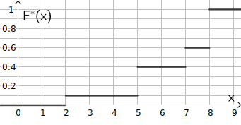
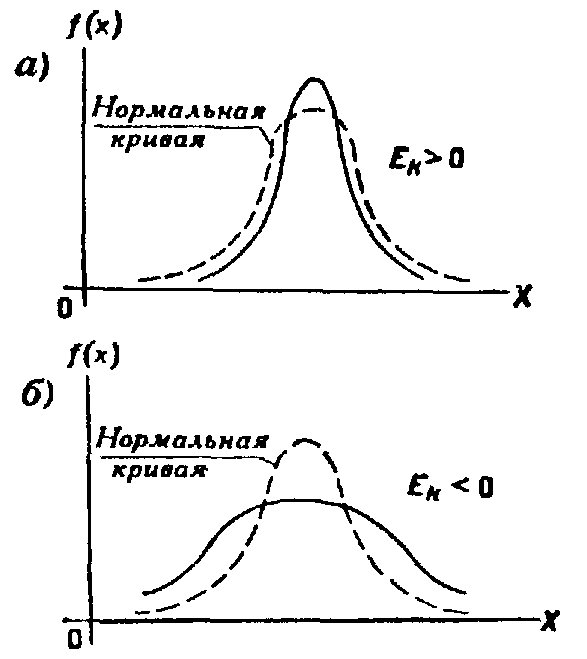

# Элементы математической статистики

1. Выборочный метод
2. Статистические оценки параметров распределения
3. Методы расчета сводных характеристик выборки

## Выборочный метод

### Задачи МС

1. Указать способы сбора и группировки статистических сведений, полученных в результате наблюдений или экспериментов. 
2. Разработать методы анализа статистических данных
  - Оценка неизвестной вероятности события  
  - оценка неизвестной функции распределения 
  -  оценка параметров распределения 
  -  оценка зависимости случайной величины от одной или нескольких случайных величин
3. Проверка статистических гипотез о виде неизвестного распределения или о величине параметров распределения, вид которого известен.

Современная математическая статистика разрабатывает способы определения числа необходимых испытаний до начала исследования (планирование эксперимента) и в ходе исследования (последовательный анализ).

**Задача математической статистики** — создание *методов сбора и обработки* статистических *данных для получения* научных и практических *результатов*.

### Генеральная и выборочная совокупность

**Выборочная совокупность** или **выборка** — совокупность случайно отобранных объектов.

**Генеральная совокупность** — совокупность объектов, из которых производится выборка.

**Объем совокупности** — число объектов этой совокупности.

$⊗$ Пусть из 1000 деталей отобрано 100 деталей для обследования, тогда объем генеральной совокупности 1000, а объем выборки 100.

### Повторная и бесповторная выборки. Репрезентативная выборка

- Выборка
  - **Повторная** — такая, при которой отобранный объект возвращается в генеральную совокупность.
  - **Бесповторная** — такая, при которой отобранный объект генеральную совокупность не возвращается, уменьшая объём.

Что по данной выборке можно было достаточно уверенно судить об интересующем нас признаке генеральной совокупности, необходимо, чтобы объекты выборки правильно его представляли, то есть выборка должна правильно представлять **пропорции** генеральной совокупности.

### Статистическое распределение выборки

Пусть из генеральной совокупности извлечена выборка объема $n$, при этом 

> значение $x_1$наблюдаются $n_1$ раз, 
> 
> …
> 
> значение $x_k$ наблюдаются $n_k$ раз, при этом $\sum n_i = n$

**Варианта** — наблюдаемое значение $x_i$.

**Вариационный ряд** — последовательность вариант, записанных в порядке возрастания. 

**Частота** (вырианты) — число наблюдений $n_i$.

**Относительная частота** (вырианты) — отношение частоты к объему выборки

$$w_i = \frac {n_i} n$$

**Статистическое распределение выборки** — перечень вариант, записанных в порядке возрастания и соответствующих им частот или относительных частот.

$⊗$ Задано распределение частот выборки, объемом $n=20$. Найти распределение относительных частот.

| $x_i$  | $n_i$ | $w_i$ |
| ------ | ----- | ----- |
| 2      | 3     | 3/20  |
| 6      | 10    | 10/20 |
| 12     | 7     | 7/20  |
| $\sum$ | 20    | 1     |

Обычно при этом результат наблюдений фиксируют в протоколе наблюдений в порядке их наблюдения

$⊗$
2, 4, 2, 4, 3, 
3, 3, 0, 2, 4, 
3, 2, 2, 4, 5, 
4, 3, 4, 3, 3, 5.

В выборке одно значение варианты может встречаться несколько раз, Следовательно целесообразно составить **таблицу** статистического распределения. Для составления таблицы необходимо

1. Найти минимальное $x_{\text{min}}$ и максимальное $x_{\text{max}}$ значение выборки
2. В первый столбец записать $x_i$, начиная от минимального до максимального.
3. Просмотреть все элементы выборки и отметить каждое значение во втором столбце таблицы.
  1. Если объем выборки велик, то существует метод подсчёта меток. Каждый 4 метки перечеркиваются пятой. 
4. Посчитать количество меток и записать соответствующее число $n_i$ в третий столбец.
5. Подсчитать объем выборки $n = \sum_{i=1}^k{n_i}$, где $k$ — число различных вариант
6. В четвёртом столбце записать относительные частоты $w_i$

$⊗$

| $x_i$  |                    | $n_i$   | $w_i$   |
| ------ | ------------------ | ------- | ------- |
| 0      | $|$                | 1       | 1/21    |
| 1      |                    | 0       | 0       |
| 2      | $||||\diagdown$    | 5       | 5/21    |
| 3      | $||||\diagdown$ || | 7       | 7/21    |
| 4      | $||||\diagdown$|   | 6       | 6/21    |
| 5      | $||$               | 21      | 21/21   |
| $\sum$ |                    | 21      | 1       |

Если $k$ слишком велико, или близко к $n$, то составляют вариационный ряд по интервалам значений генеральной совокупности.

Вариационный ряд по интервалам можно получить из приведённого выше алгоритма: во 2 пункте заполнить первый столбец интервалами значений генеральной совокупности, все интервалы выбирают одинаковой длины $h$, так, чтобы минимальное значение вошло в 1 интервал, максимальное — в последний.

Обычно начало интервала учитывается при подсчете меток, а его окончание — нет ($[a,b)$).

$⊗$

| $\Delta x_i$ | $n_i$ | $x_{i\text{ср}}$ |
| ------------ | ----- | ---------------- |
| 20-25        | 3     | 22,5             |
| 25-30        | 10    | 27,5             |
| 30-35        | 11    | 32,5             |

### Полигон и гистограмма {#Полигон_и_гистограмма}

- _Полигон частот_ это ломаная, отрезки которой соединяют точки с координатами $(x_i;n_i)$
  - _Полигон относительных частот_ — ломаная, отрезки которой соединяют точки с координатами $(x_i;w_i)$.
- _Гистограмма_. Над каждым значением строят прямоугольник, высота которого пропорциональна $n_i$.

### Эмпирическая функция распределения

Пусть известно статистическое распределение частот количественного признака $X$, например контролируемый размер детали, объём выборки $n$, число наблюдений $n_x$, при которых наблюдаемое значение признака $X<x$. 

Относительная частота события $``X<x"$ равна $\frac {n_x} n$.

Если изменяется $x$, то изменяется и относительная частота $\frac {n_x} n$, то есть она является функцией от $x$. Так как эта функция находится опытным путем, то ее называют **эмпирической**.

**Эмпирическая функция распределения выборки** или просто **функция распределения** — функция, определяющая для всех значений случайной величины $x$ относительную частоту события $``X<x"$

$$F^*(x) = \frac {n_x} n$$,

где $n_x$ — число вариант, для которых $``X<x"$.

**Теоретическая функция распределения** — функция $F(x)$ распределения генеральной совокупности.

$F(x)$ определяет *вероятность* события $``X<x"$,

$F^*(x)$ определяет *относительную частоту* этого же события. 

Поэтому целесообразно использовать $F^*(x)$ для приближенного представления теоретической (интегральной) функции распределения генеральной совокупности. 

----------

$⊗$ Построить ЭФР по распределению выборки.

| $x_i$  | $n_i$ | $w_i$ | $n_x$ |
| ------ | ----- | ----- | ----- |
| 2      | 12    | 12/60 | 0     |
| 6      | 10    | 18/60 | 12    |
| 10     | 30    | 30/60 | 30    |
| $\sum$ | 60    | 1     |       |

> $$F^*(x) = \begin{cases}0, & x<2 \\ 12/60, & 2 ⩽ x < 6 \\ 30/60, & 6 ⩽ x < 10 \\ 1, & x ⩾ 10 \end{cases}$$

$⊗$ Построить ЭФР по распределению выборки.

| $x_i$  | $n_i$ | $w_i$ | $n_x$ |
| ------ | ----- | ----- | ----- |
| 2      | 1     | 0     | 0     |
| 5      | 3     | 1     | 0,1   |
| 7      | 2     | 4     | 0,4   |
| 8      | 4     | 6     | 0,6   |
| $\sum$ | 10    |       | 1     |

> $$F^*(x) = \begin{cases} 0, & x < 2 \\0,1, & 2 ⩽ x < 5 \\ 0,4, & 5 ⩽ x < 7 \\ 0,6, & 7 ⩽ x < 8 \\ 1, & x ⩾ 8 \end{cases}$$
>
> 
  
$⊗$ То же задание для примера из [предыдущего пункта](#Полигон_и_гистограмма)

## Числовые характеристики выборки

### Выборочная средняя

Пусть для изучения генеральной совокупности относительно количественного признака $X$ извлечена выборка объема $n$. 
Выборочной средней $\overline {x_{\text{в}}}$ называют среднее значение признака выборочной совокупности. 
Если все значения $x_1, x_2, \ldots x_n$ признака выборки  объема $n$ различны, то 

$$\overline {x_{\text{в}}} = \frac {\sum{x_i}}{n}.$$

Если же значения признака $x_1, x_2, \ldots x_k$  имеют соответственно частоты $n_1, n_2, \ldots n_k$, причем $n_1 + n_2 + \ldots + n_k = n$, то

$$\overline {x_{\text{в}}} = \frac {\sum{x_in_i}}{n}.$$

### Выборочная дисперсия 

Для того чтобы охарактеризовать рассеяние наблюдаемых значений количественного признака выборки вокруг своего среднего значения $\overline {x_{\text{в}}}$, вводят сводную характеристику — выборочную дисперсию. 

Выборочной дисперсией $D_{\text{в}}$ называют среднее арифметическое квадратов отклонения наблюдаемых значений признака от их среднего значения $\overline {x_{\text{в}}}$. 

Если все значения $x_1, x_2, \ldots x_n$ признака выборки  объема $n$ различны, то 

$$ D_{\text{в}} = \frac {\sum{(x_i - \overline {x_{\text{в}}})^2}}{n}.$$

Если же значения признака $x_1, x_2, \ldots x_k$  имеют соответственно частоты $n_1, n_2, \ldots n_k$, причем $n_1 + n_2 + \ldots + n_k = n$, то

$$D_{\text{в}} = \frac {\sum{n_i(x_i - \overline {x_{\text{в}}})^2}}{n}.$$

$⊗$ Выборочная совокупность задана таблицей распределения. Найти $D_{\text{в}}$.

| $x_i$  | $n_i$ |
| ------ | ----- |
| 1      | 20    |
| 2      | 15    |
| 3      | 10    |
| 4      | 5     |
| $\sum$ | 50    |

> $$\overline {x_{\text{в}}} = \frac {\sum{x_in_i}}{n}= \frac {1 ⋅ 20 + 2 ⋅ 15 + 3 ⋅ 10 + 4 ⋅ 5}{50}= 2$$

> $$ D_{\text{в}} = \frac {\sum{n_i(x_i - \overline {x_{\text{в}}})^2}}{n} = \frac {20 ⋅ (1 - 2)^2 + 15 ⋅ (2 - 2)^2 + 10 ⋅ (3 - 2)^2 + 5 ⋅ (4 - 2)^2}{50} = 1 $$

### Выборочное среднеквадратическое отклонение

$$σ_{\text{в}} = \sqrt{D_{\text{в}}}$$

$⊗$ Пусть за один час четверо рабочих сделали 25, 21, 30, 28 деталей соответственно. Вычислить среднюю производительность труда на участке и среднеквадратическое отклонение выборки.

> $$\overline {x_{\text{в}}} = = \frac {25+21+30+27}{4} = 26$$
>
> $$D_{\text{в}} = \frac {     {(-2)}^2 +     {(-5)}^2 +     {4}^2 +     {2}^2 }{4} = 11,5$$
>
> $$ σ_{\text{в}} = \sqrt{D_{\text{в}}} = 3,4 $$

### Мода

_Мода_ $Mo$ — варианта, имеющая наибольшую частоту.

$⊗$ Дана выборка.

| $x_i$  | $n_i$ |
| ------ | ----- |
| 1      | 3     |
| 4      | 4     |
| 7      | 10    |
| 10     | 7     |

> $$ Mo = 7 $$

### Медиана

_Медиана_ $Me$ — варианта, делящая вариационный ряд на 2 части, равные по длине.

* Если число вариант нечетно: $⊗$ 1, 2, 5, __7__, 10, 13, 18, то $Me=7$.
* Если число вариант четно: $⊗$ 1, 2, __5, 7__, 10, 13, то $Me=\frac 1 2 ⋅ (5+7)=6$.

## Методы расчета сводных характеристик выборки

### Условные варианты

Упрощенные методы расчета сводных характеристик выборки основаны на замене первоначальных вариант условными. 

Условными называют варианты, определяемые равенством 

$$
u_i = \frac {x_i - c} h
$$

где

- $c$ — ложный нуль (новое начало отсчета); 
- $h$ — шаг, т. е. разность между любыми двумя соседними первоначальными вариантами (новая единица масштаба). 

В качестве ложного нуля обычно применяют моду $Mo$.

$⊗$ Найти условные варианты распределения.

| $x_i$  | $n_i$ | $u_i$ |
| ------ | ----- | ----- |
| 23,6   | 5     | -2    |
| 28,6   | 20    | -1    |
| 33,6   | 50    | 0     |
| 38,6   | 15    | 1     |
| 43,6   | 10    | 2     |

> $h=5$, $c=33,6$.
>
> ~~$u_2 = \frac {28,6 - 33,6} 5 = 1$~~

Если верно выбран ложный ноль, то условные моменты считать не надо.

### Обычные, и условные эмпирические моменты

Для вычисления сводных характеристик выборки удобно пользоваться эмпирическими моментами.

Обычным эмпирическим моментом порядка $k$ называют среднее значение $k$-x степеней разностей $x_i-c$: где $x$, — наблюдаемая варианта, $n_i$ — частота варианты, $n = \sum {n_i}$ — объем выборки, $c$—произвольное постоянное число (ложный нуль).

$$
M_k = \frac {n_i(x_i-c)^k} n
$$

В частном случае

* $c=0$: $M_1 = \overline {x_{\text{в}}}$
* $c=\overline {x_{\text{в}}}$: $M_2 = D_{\text{в}}$

#### Условные эмпирические моменты

Вычисление центральных моментов требует довольно громоздких вычислений. Чтобы упростить расчеты, заменяют первоначальные варианты условными. 

_Условным эмпирическим моментом_ порядка $k$ называют начальный момент порядка $k$, вычисленный для условных вариант: 

$$
M_k^* = \frac {n_i(\frac {x_i-c} h)^k} n
$$

В частности,

$$
\overline {x_{\text{в}}} = M_1^* ⋅ h + c
$$

$$
D_{\text{в}} = (M_2^* - M_1^{*^2}) ⋅ h^2
$$

### Метод произведений для вычисления выборочных средней и дисперсии

Пользуются расчетной таблицей, которая составляется так: 

1. в первый столбец таблицы записывают выборочные (первоначальные) варианты $x_i$ в возрастающем порядке; 
2. во второй столбец записывают частоты вариант $n_i$; складывают все частоты и их сумму (объем выборки $n$) помещают в нижнюю клетку столбца; 
3. в третий столбец записывают условные варианты $u_i = \frac {x_i - c} h$, причем в качестве ложного нуля $c$ выбирают варианту, которая расположена примерно в середине вариационного ряда, и полагают $h$ равным разности между любыми двумя соседними вариантами; практически же третий столбец заполняется так: в клетке строки, содержащей выбранный ложный нуль, пишут 0; в клетках над нулем пишут последовательно $-1$, $-2$, $-3$ и т.д., а под нулем — $1$, $2$, $3$ и т.д.;
4. умножают частоты на условные варианты и записывают их произведения $n_iu_i$ в четвертый столбец; сложив все полученные числа, их сумму $\sum {n_iu_i}$ помещают в нижнюю клетку столбца; 
5. умножают частоты на квадраты условных вариант и записывают их произведения $n_iu_i^2$ в пятый столбец; сложив все полученные числа, их сумму $\sum {n_iu_i^2}$ помещают в нижнюю клетку столбца; 
6. умножают частоты на квадраты условных вариант, увеличенных каждая на единицу, и записывают произведения $n_i(u_i+1)^2$ в шестой контрольный столбец; сложив все полученные числа, их сумму $\sum{n_i(u_i+1)^2}$ помещают в нижнюю клетку столбца. 

Предусмотрен контроль: если сумма $\sum{n_i(u_i+1)^2}$ окажется равной сумме $n + 2\sum {n_iu_i} + \sum {n_iu_i^2}$ то вычисления проведены правильно. 

| $x_i$  | $n_i$ | $u_i$ | $n_iu_i$ | $n_iu_i^2$ | $n_i(u_i+1)^2$ |
| -------- | ------- | ------- | ---------- | ------------ | ---------------- |
| ...      | ...     | ...     | ...        | ...          | ...              |
| $Σ$        | ...     | $Σ$       | ...        | ...          | ...              |

$⊗$ 

> | $x_i$  | $n_i$ | $u_i$ | $n_iu_i$ | $n_iu_i^2$ | $n_i(u_i+1)^2$ |
> | ------ | ----- | ----- | -------- | ---------- | -------------- |
> | 23,6   | 5     | -2    | -10      | 20         | 5              |
> | 28,6   | 20    | -1    | -20      | 20         | 0              |
> | 33,6   | 50    | 0     | 0        | 0          | 50             |
> | 38,6   | 15    | 1     | 15       | 15         | 60             |
> | 43,6   | 10    | 2     | 20       | 40         | 90             |
> | $Σ$    | 100   | $Σ$   | 5        | 95         | 205            |
> 
> Проверка: $95+5 ⋅ 2+ 100 = 205$.
> 
> * $M_1^* = \frac {5}{100} = 0,05$, $\overline {x_{\text{в}}} = M_1^* ⋅ 5 + 33,6 = 33,85$
> * $M_2^* = \frac {95}{100} = 0,95$, $D_{\text{в}} = (M_2^* - M_1^{*^2}) ⋅ h^2 = 23,7$, $σ_{\text{в}} = \sqrt{D_{\text{в}}} = 4,87$

### Эмпирические и выравнивающие (теоретические) частоты. Построение нормальной кривой по опытным данным

1. находят $\overline {x_{\text{в}}}$ и $σ_{\text{в}}$, например, по методу произведений; 
2. находят ординаты, выравнивающие частоты теоретической кривой по формуле

   $$n_i' = \frac {nh} {σ_{\text{в}}} ⋅ \varphi(v_i),$$
   
   где $n$ — сумма наблюдаемых частот, $σ_{\text{в}}$ — разность между двумя соседними вариантами: $v_i = \frac{x_i-\overline {x_{\text{в}}}}{σ_{\text{в}}}$ и $\varphi(x)$ — функция Лапласа.

Выравнивающие частоты находят, чтобы проверить, согласуется ли выбранный закон распределения с данными наблюдений.

Результаты пишут в таблицу:

| $x_i$  | $n_i$ | $x_i-\overline {x_{\text{в}}}$ | $v_i$ | $\varphi(v_i)$ | $n_i'$ |
| ---- | -- | ------ | ------- | ------ | ------- |
| 23,6 | 5  | -10.25 | -2.1060 | 0.0434 | 4.4616  |
| 28,6 | 20 | -5.25  | -1.0787 | 0.2230 | 22.9061 |
| 33,6 | 50 | -0.25  | -0.0514 | 0.3984 | 40.9305 |
| 38,6 | 15 | 4.75   | 0.9760  | 0.2478 | 25.4558 |
| 43,6 | 10 | 9.75   | 2.0033  | 0.0536 | 5.5102  |

(23.6, 4.4616)
(28.6, 22.9061)
(33.6, 40.9305)
(38.6, 25.4558)
(43.6, 5.5102)

В одной координатной системе строят кривые: опытную ($n_i$) и теоретическую ($n_i'$)

### Оценка отклонения эмпирического распределения от нормального. Асимметрия и эксцесс

Для оценки отклонения эмпирического распределения от нормального используют характеристики: асимметрию и эксцесс.

Ассиметрия характеризует симметричность нормальной кривой относительно ее вершины. Она положительна, если кривая сдвинута влево; отрицательна, если — вправо (см. рис.).

_Асимметрия эмпирического распределения_ определяется равенством

$$
a_s = \frac {m_3}{σ_{\text{в}}^3}
$$

где $m_3$— центральный эмпирический момент третьего порядка.

$$
m_3 = (M_3^* - 3M_1^*M_2^* + 2M_1^{*^3})h^3
$$

Эксцесс характеризует расплывание или сужение нормальной кривой. Положителен, если вершина выше и острее; отрицателен, если — ниже и положе (см. рис.).

_Эксцесс эмпирического распределения_ определяется равенством

$$
e_k = \frac {m_4}{σ_{\text{в}}^4} - 3
$$

, где $m_4$—центральный эмпирический момент четвертого порядка.

$$
m_4 = (M_4^* - 4N1M_3^* + 6M_1^{*^2} - 3M_1^{*^4})h^4
$$

## Статистические оценки параметров распределения

### Понятие оценки

Генеральная совокупность характеризуется некоторыми постоянными числовыми характеристиками распределения. По выборкам можно найти оценки этих характеристик. Так как выборки случайны, то значение оценок одной числовой характеристики, вычисленной по разным выборкам одной и той же генеральной совокупности могут быть различны.

Обозначим неизвестный параметр распределения, то есть числовую характеристику генеральной совокупности через $Θ$, а оценку этого параметра $T_n$. Оценка $T_n$ — функция от выборки. Оценки неизвестного параметра можно находить по выборкам различными способами.

$⊗$ Если нужно оценить среднее значение $Θ=μ$ нормального распределения, то можно воспользоваться следующими оценками:

1. $x_1$. На практике так и поступают: измеряют величину один раз и этот результат используют как среднее значение этой величины.
2. $\frac {x_{\min}+x_{\max}}{2}$
3. $Mo$. Для нормального распределения $μ=Mo$.
4. $Me$. Для нормального распределения $μ=Me$.
5. $\overline {x_{\text{в}}}$

Для того, чтобы установить, какая из оценок лучше, надо знать основные свойства и виды оценок.

### Несмещенные и эффективные оценки

Для того чтобы статистические оценки давали «хорошие» приближения оцениваемых параметров, они должны удовлетворять определенным требованиям:

*Несмещенной* называют статистическую оценку $T_n$, математическое ожидание которой равно оцениваемому параметру $Θ$ при любом объеме выборки, т. е.

$$
M(T_n) = Θ
$$

Иначе оценку называют смещенной и вычисляют смещение:

$$
M(T_n) - Θ
$$ 

$⊗$ Для НР несмещенной оценкой $μ$ является $\overline {x_{\text{в}}}$.

Однако было бы ошибочным считать, что несмещенная оценка всегда дает хорошее приближение оцениваемого параметра. Действительно, возможные значения $T_n$  могут быть сильно рассеяны вокруг своего среднего значения, т е. дисперсия $D_{\text{в}}$ может быть значительной. Поэтому к статистической оценке предъявляется требование эффективности.

*Эффективной* называют статистическую оценку, которая (при заданном объеме выборки $n$) имеет наименьшую возможную дисперсию. 

$⊗$ Рассмотренная выше выборочная дисперсия является смещенной оценкой генеральной дисперсии, то есть

$$
M(D_{\text{в}}) = \frac {n-1} n D_{\text{г}}
$$

тогда смещение равно

$$
\frac 1 n D_{\text{г}}
$$

Видно, что при $n\to \infty$ смещение стремится к 0. Значит, при достаточно большом объеме выборки $n$ $D_{\text{в}}$ может приблизительно принимать за несмещенную оценку генеральной дисперсии.

$$
D_{\text{г}} \approx D_{\text{в}}
$$

Для оценки дисперсии при малом объеме выборки используют исправленную выборочную дисперсию $S^2$.

$$
S^2 = \frac n {n-1} D_{\text{в}}
$$

$S^2$ является несмещенной оценкой $D_{\text{г}}$

$$
M(S^2) = D_{\text{г}}
$$

А исправленное среднеквадратическое отклонение $S$

$$
S=\sqrt{\frac n {n-1} D_{\text{в}}}
$$

### Доверительная вероятность (надежность). Доверительный интервал

Точечной называют оценку, которая определяется одним числом. Все оценки, рассмотренные выше,— точечные.

Все точечные оценки параметров распределения вычисляются по выборкам, но из-за их случайности оценки $T_n$ являются СВ, отличающиеся от истинного значения $Θ$.

Обозначим точность оценки $δ>0$, тогда

$$
|Θ-T_n|⩽ δ
$$ 

Чем меньше $δ$, тем точнее оценка.

*Надежностью (доверительной вероятностью) оценки* 
$Θ$ по $T_n$ называют вероятность $γ$, с которой осуществляется неравенство $|Θ-T_n|⩽ δ$. 

$$
P(|Θ-T_n|⩽ δ) = γ
$$ 
$$
P(T_n-δ⩽ Θ⩽ T_n+δ) = γ
$$ 

Обычно надежность оценки задается наперед, причем в качестве у берут число, близкое к единице. Наиболее часто задают надежность, равную 0,95; 0,99 и 0,999. 

### Доверительные интервалы для оценки математического ожидания нормального распределения при известном $σ$

Пусть количественный признак $X$ генеральной совокупности распределен нормально, причем $σ$ этого распределения известно. 
Требуется оценить неизвестное $μ$ по выборочной средней $\overline {x_{\text{в}}}$. Поставим своей задачей найти доверительный интервал, покрывающий параметр $μ$ с надежностью $γ$.

Все элементы выборки, имеющие то же распределение, что и ГС

$$
x_i \equiv N(μ iσ)
$$

$$
\overline {x_{\text{в}}} \equiv N\left(μ ;\frac σ {\sqrt n}\right)
$$

(глава 8 п 9)

Решаем

$$
P(|\overline {x_{\text{в}}}-μ|⩽ δ) = γ
$$

Из ТВ мы знаем, как найти вероятность того, что СВ, распределенная нормально, принимает значения, отличающиеся от $μ$ не более, чем на $δ$

$$
P(|\overline {x_{\text{в}}}-μ|⩽ δ) = 2\Phi\left(\frac δσ\right)
$$

Заменив $σ$ на $\frac σ {\sqrt n}$ можем сказать

$$
P(|\overline {x_{\text{в}}}-μ|⩽ δ) = 2\Phi\left(t\right),
$$

где $t=\frac {δ\sqrt n}σ$.

Тогда

$$
P(\overline {x_{\text{в}}}-δ⩽ μ⩽\overline {x_{\text{в}}}+δ )=γ=2\Phi\left(t\right),
$$

где $δ=\frac {σ t} {\sqrt n}$.

То есть с надежностью $γ$ можно утверждать, что доверительный интервал 

$$
\left( \overline {x_{\text{в}}}-\frac {σ t} {\sqrt n} ; 
x_{\text{в}}+\frac {σ t} {\sqrt n}
 \right)
$$
заключает в себя неизвестный параметр $μ$,  где t — решение уравнения $γ=2\Phi\left(t\right)$

$⊗$ $X$ имеет НР с $σ=3$. Найти доверительный интервал для оценки $μ$ по $\overline {x_{\text{в}}}=22,6$, если $n=36$, $γ=0,95$.

> $2\Phi(t) = γ$
>
> $\Phi(t) = 0,475$
>
> $t = 1,96$
>
> $δ = \frac{1,96 ⋅ 3}{6}=0,98$
>
> $22,6-0,98⩽μ⩽  22,6+0,98$
>
> $21,62⩽μ⩽  23,58$

### Доверительные интервалы для оценки математического ожидания нормального распределения при неизвестном $σ$

Пусть количественный признак $X$ генеральной совокупности распределен нормально, причем $σ$ этого распределения известно. Требуется оценить неизвестное $μ$ с помощью доверительных интервалов.

Оказывается, что по данным выборки можно построить случайную величину $T$,ее возможные значения будем обозначать через $t$:

$$
T=\frac{\overline {x_{\text{в}}}-μ}{S/\sqrt n},
$$

которая имеет распределение Стьюдента; здесь 

$\overline {x_{\text{в}}}$ — выборочная средняя, $S$ — «исправленное» среднее 
квадратическое отклонение, $n$ — объем выборки.

Плотность этого распределения описывается формулой, зависящей только от объема выборки.

Пользуясь этим распределением, определим доверительный интервал для $μ$.

$$
\left( \overline {x_{\text{в}}}-\frac {st_γ} {\sqrt n} ; 
x_{\text{в}}+\frac {st_γ} {\sqrt n}
 \right)
$$

$t_γ=t(n;γ)$.

$⊗$ Количественный признак распределен нормально.  По выборке с $n = 16$ найдено $\overline {x_{\text{в}}}=20,2$ и $S=0,8$. Оценить $μ$ с помощью довериьтельного интервала с $γ=0,95$.

> $t(16;0,95)=2,13$
> 
> $\left( 20,2-\frac{2,13 ⋅ 0,8}{4};20,2+\frac{2,13 ⋅ 0,8}{4} \right)$
> 
> $19,77⩽μ⩽ 20,53$

### Доверительные интервалы для оценки среднего квадратического отклонения $σ$ нормального распределения

Пусть количественный признак $X$ генеральной совокупности распределен нормально. совокупности распределен нормально. Требуется оценить 
неизвестное генеральное среднее квадратическое отклонение $σ$ по «исправленному» выборочному среднему квадратическому отклонению $s$. Поставим перед собой задачу 
найти доверительные интервалы, покрывающие параметр 
$σ$ с заданной надежностью $γ$.

Потребуем

$P(|σ-s|< δ)=γ$, или $P(s-δ <σ<s+δ)=γ.$

$$
s(1-δ/s) <σ<s(1+δ/s)
$$

Положим $δ/s=q$, получим

$$
s(1-q) <σ<s(1+q)
$$

$q$ находим по таблице распределения Пирсона

$$
q=q(n,γ)
$$

$⊗$ Количественный признак $X$ распределен нормально. По выборке с $n = 25$ найдено $S=0,8$. Найти доверительный интервал, включающий $σ$ с $γ=0,95$.

> $q(25;0,95)=0,32$
> $0,8 ⋅ 0,68 ⩽ σ⩽ 0,8 ⋅ 1,32$
> 
> $0,544⩽ σ⩽1,056$

_Замечание_. Если $q>1$, то доверительный интервал односторонний:

$$
0⩽ σ⩽ s(1+q)
$$

То есть

$$
\max(0;s(1-q))⩽ σ⩽ s(1+q)
$$
